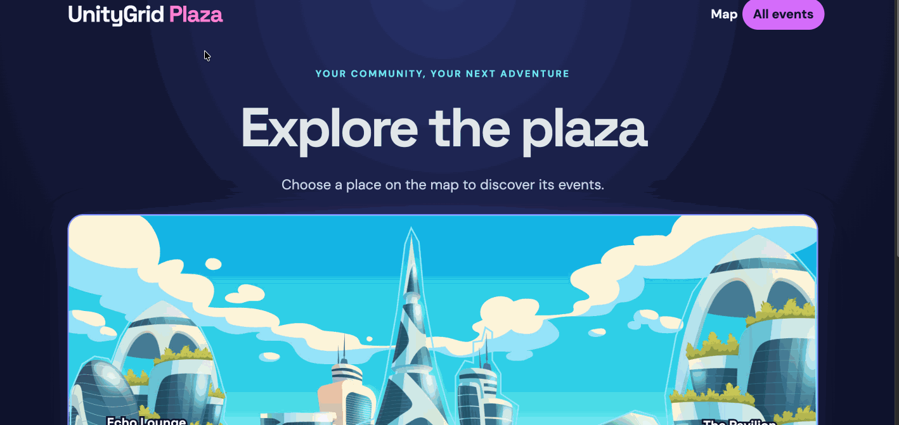

# UnityGrid Plaza

A virtual community space where visitors explore four locations on an illustrated map and discover their events. Built with React, Express, and PostgreSQL.

## Features

- [x] React displays location and event data from the API.
- [x] Express exposes routes for locations and events.
- [x] PostgreSQL tables model locations and their events.
- [x] The front page has a title and an interactive visual map with four selectable locations.
- [x] Each location has its own URL and lists only events at that location.
- [x] An All Events page lists every event and filters by location.
- [x] Event cards show a live countdown and visually distinguish past events.
- [x] Connect and verify a Render PostgreSQL database.
- [x] Add a GIF walkthrough of the running app before submission.

## Walkthrough

## Run locally

1. Install dependencies with `npm install`.
2. Create a PostgreSQL database.
3. Copy `server/.env.example` to `server/.env` and enter your database credentials. For a local database, set `PGSSLMODE=disable`. You may use `DATABASE_URL` instead of the individual `PG*` fields.
4. Run `npm run db:seed` to create the tables and insert sample locations and events. The seed command can be run again without duplicating those records.
5. Run `npm run dev`. Open the Vite URL printed in the terminal (usually `http://localhost:5173`).

## Connect Render PostgreSQL

Create a Render PostgreSQL database, then set either its external connection URL as `DATABASE_URL` or its five `PG*` connection fields in `server/.env`. Set `PGSSLMODE=require` for the external connection. Run `npm run db:seed`, then `npm run dev`. The `.env` file is ignored by Git and must not be committed.

Render currently permits one active free PostgreSQL database per workspace; free databases expire after 30 days. See [Render's free tier documentation](https://render.com/docs/free). [Render's connection guide](https://render.com/docs/postgresql-creating-connecting) explains the internal and external URLs.

For a Render web service, set the build command to `npm install && npm run build` and the start command to `npm start`. Add the same database environment variables to the web service. The production server serves the built React app and its `/api` routes.

## API

| Route | Purpose |
| --- | --- |
| `GET /api/locations` | All locations |
| `GET /api/locations/:slug` | One location |
| `GET /api/locations/:slug/events` | Events at one location |
| `GET /api/events` | All events; optional `?location=slug` filter |
| `GET /api/events/:id` | One event |

The seed script uses fictional UnityGrid City addresses and sample event descriptions. Event start times are stored as `TIMESTAMPTZ` and displayed in the America/Chicago time zone.
