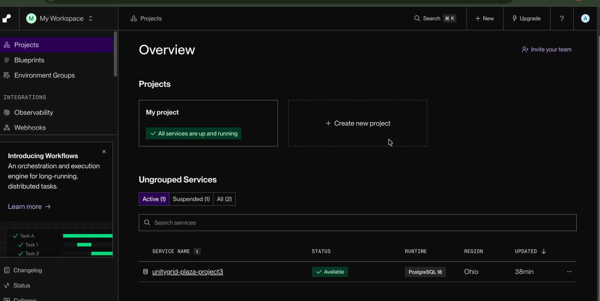

# WEB103 Project 3 - UnityGrid Plaza

Submitted by: **Adhik Adhikari**

About this web app: **A virtual community plaza where visitors select one of four locations on an illustrated map and discover its events.**

Time spent: **4** hours

## Required Features

The following **required** functionality is completed:

- [x] **The web app uses React to display data from the API**
- [x] **The web app is connected to a PostgreSQL database, with an appropriately structured Events table**
  - [x] **NOTE: Your walkthrough added to the README must include a view of your Render dashboard demonstrating that your Postgres database is available**
  - [x] **NOTE: Your walkthrough added to the README must include a demonstration of your table contents. Use the psql command 'SELECT * FROM tablename;' to display your table contents.**
- [x] **The web app displays a title.**
- [x] **Website includes a visual interface that allows users to select a location they would like to view.**
  - [x] *Note: A non-visual list of links to different locations is insufficient.*
- [x] **Each location has a detail page with its own unique URL.**
- [x] **Clicking on a location navigates to its corresponding detail page and displays list of all events from the `events` table associated with that location.**

The following **optional** features are implemented:

- [x] An additional page shows all possible events
  - [x] Users can sort *or* filter events by location.
- [x] Events display a countdown showing the time remaining before that event
  - [x] Events appear with different formatting when the event has passed (ex. negative time, indication the event has passed, crossed out, etc.).

The following **additional** features are implemented:

- [x] The map and event pages adapt to smaller screens.
- [x] Location links have accessible names and visible keyboard focus styles.

## Video Walkthrough

Here's a walkthrough of implemented required features:

GIFs created with LICEcap. The second walkthrough shows the Render database status and the `events` table through `psql`.

## Notes

The app uses a React frontend, an Express API, and a Render PostgreSQL database. The API exposes locations, individual locations, events at a location, all events, and individual events. Event dates are stored as `TIMESTAMPTZ` and displayed in the America/Chicago time zone.

To run locally:

1. Run `npm install`.
2. Copy `server/.env.example` to `server/.env` and enter PostgreSQL credentials. The `.env` file is ignored by Git.
3. Run `npm run db:seed` to create and seed the database.
4. Run `npm run dev` and open the Vite URL shown in the terminal.

To display the Events table for the database walkthrough, run `npm run db:show`. It invokes `psql` with `SELECT * FROM events;` using the credentials in `server/.env` without showing the password. PostgreSQL command-line tools must be installed.

The starter app had map artwork and page shells, but the API, database schema, event loading, and event formatting were unfinished. Connecting the four map locations to their database-backed pages was a central implementation challenge.

## License

Copyright 2026 Adhik Adhikari

Licensed under the Apache License, Version 2.0 (the "License"); you may not use this file except in compliance with the License. You may obtain a copy of the License at

> http://www.apache.org/licenses/LICENSE-2.0

Unless required by applicable law or agreed to in writing, software distributed under the License is distributed on an "AS IS" BASIS, WITHOUT WARRANTIES OR CONDITIONS OF ANY KIND, either express or implied. See the License for the specific language governing permissions and limitations under the License.
